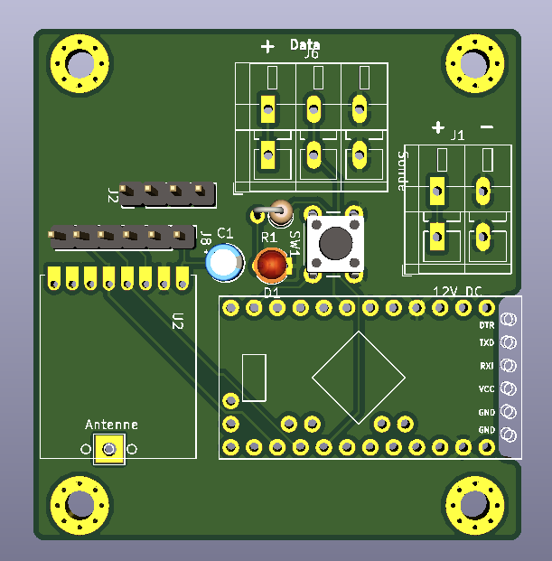
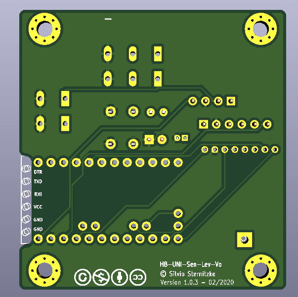

# HB-UNI-Sen-Lev-Vo
Sensor für Voltronic-Sonden

  - Votronic 12-24K
  - Votronic 15-50K
  - Votronic 30-110K
  - Votronic 20-K-WC

## Bilder

## Konfiguration
### auf der Platine

### im SourceCode

### in der CCU/Raspberymatic

## Schaltplan

[:arrow_right: Schaltplan](Images/*.pdf)

## Platine

[:arrow_right: PCB Gerber](Platine/HB-UNI-Sen-Lev-Vo.zip)

## Gehäuse

## Aufbau / Stückliste

### Der Aufbau

### Die benötigten Bauteile
| Bauteil | Link |
| --------|------|

## Hinweise

- :exclamation: 

## CCU2/CCU3/RaspberryMatic Installation

Einstellungen/Systemsteuerung/Zusatzsoftware -> Datei 

Ich nutze das AddOn von Jérôme (jp112sdl) [JP-HB-Devices-addon](https://github.com/jp112sdl/JP-HB-Devices-addon).
In dieses bzw. dessen Struckture müssen die Dateien aus dem Verzeichniss [AddOn](AddOn) entsprechend selbst eingebunden werden und das AddOn dann installiert werden.

## Benötige Libraries

  - [AskSinPP](https://github.com/pa-pa/AskSinPP)
   - sowie die dort aufgeführten [zusätzlichen Bibliotheken](https://github.com/pa-pa/AskSinPP#required-additional-arduino-libraries)

## Lizenz

**Creative Commons BY-NC-SA** 
Give Credit, NonCommercial, ShareAlike

 This work is licensed under a <a rel="license" href="http://creativecommons.org/licenses/by-nc-sa/4.0/">Creative Commons Attribution-NonCommercial-ShareAlike 4.0 International License</a>.